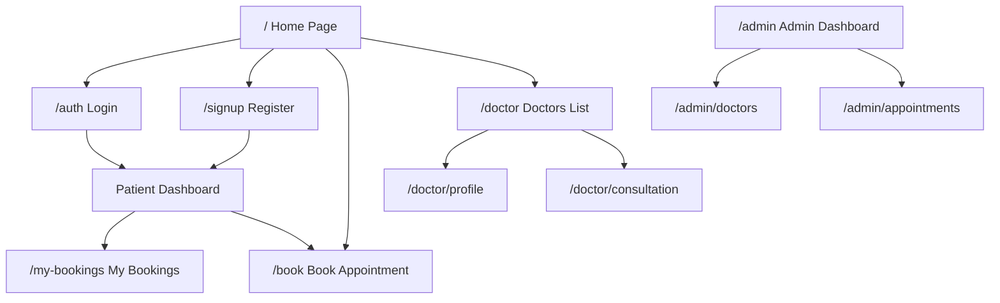
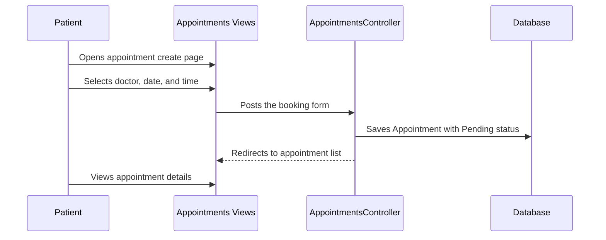
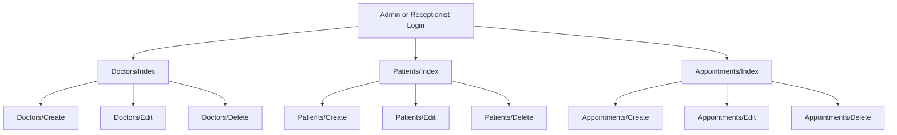

# Reaya Clinic Frontend Architecture

## Application Flow



## Complete Views Structure

```text
Views/
├── Home/
│   └── Index.cshtml
│
├── Doctors/
│   ├── Index.cshtml
│   ├── Details.cshtml
│   ├── Profile.cshtml
│   ├── Create.cshtml
│   ├── Edit.cshtml
│   └── Delete.cshtml
│
├── Patients/
│   ├── Index.cshtml
│   ├── Details.cshtml
│   ├── Create.cshtml
│   ├── Edit.cshtml
│   └── Delete.cshtml
│
└── Appointments/
    ├── Index.cshtml
    ├── Details.cshtml
`Index`, `Details`, and `Profile` are mainly for viewing data. `Create`, `Edit`, and `Delete` are used by Admin and Receptionist according to their permissions.

There are no `Departments` or `Employees` resources in this project, so they should not have MVC controllers, views, database tables, or routes.

## Identity Pages

Login and registration belong to ASP.NET Identity and remain under `Areas/Identity`.

```text
Areas/
└── Identity/
    └── Pages/
        └── Account/
            ├── Login.cshtml
            ├── Register.cshtml
            ├── ForgotPassword.cshtml
            └── ResendEmailConfirmation.cshtml
```

## Controllers

```text
Controllers/
├── HomeController.cs
├── DoctorsController.cs
├── PatientsController.cs
├── AppointmentsController.cs
└── MedicalRecordsController.cs
```

## Controller Responsibilities

| Controller | Actions | Purpose |
|---|---|---|
| `HomeController` | `Index()` | Public home page |
| `DoctorsController` | `Index()`, `Details()`, `Profile()`, `Create()`, `Edit()`, `Delete()` | View and manage doctors |
| `PatientsController` | `Index()`, `Details()`, `Create()`, `Edit()`, `Delete()` | Manage patient records |
| `AppointmentsController` | `Index()`, `Details()`, `Create()`, `Edit()`, `Delete()` | Booking and appointment management |
| `MedicalRecordsController` | `Index()`, `Details()`, `Create()`, `Edit()` | Doctor medical records |

## Doctors Controller and Views Mapping

The `DoctorsController` is the backend entry point for the doctor pages. Each action returns the View with the same name. The Views can be designed first with static presentation data, but the Controller is the part that will later load or save real data through `AppDbContext`.

```text
DoctorsController.Index()
    -> Views/Doctors/Index.cshtml
    -> Shows the doctor list and department filters

DoctorsController.Details(id)
    -> Views/Doctors/Details.cshtml
    -> Shows one doctor's profile and contact information

DoctorsController.Create() [GET]
    -> Views/Doctors/Create.cshtml
    -> Shows the empty add-doctor form

DoctorsController.Create(DoctorViewModel model) [POST]
    -> Validates the form and saves a new Doctor
    -> Redirects to Index after success

DoctorsController.Edit(id) [GET]
    -> Views/Doctors/Edit.cshtml
    -> Shows the doctor's Profile settings form

DoctorsController.Edit(id, DoctorViewModel model) [POST]
    -> Validates and updates the Doctor profile
    -> Redirects to Details or Index after success

DoctorsController.Delete(id) [GET]
    -> Views/Doctors/Delete.cshtml
    -> Shows the delete confirmation screen

DoctorsController.DeleteConfirmed(id) [POST]
    -> Deletes the Doctor after confirmation
    -> Redirects to Index after success
```

### Current Doctors Frontend Files

These files currently contain frontend-only presentation and static sample data. They do not query the database and their buttons do not save anything yet:

```text
Views/Doctors/
├── Index.cshtml    -> doctor list
├── Details.cshtml  -> doctor details
├── Create.cshtml   -> add-doctor form
├── Edit.cshtml     -> profile settings and working hours
└── Delete.cshtml   -> delete confirmation
```

The following file is still needed when the frontend is connected:

```text
Controllers/DoctorsController.cs
```

At that point, replace the static cards and form values with a strongly typed ViewModel. Keep database queries in the Controller or service layer, not inside the `.cshtml` files.

## Permissions

| Resource | Admin | Receptionist | Doctor | Patient |
|---|---|---|---|---|
| Doctors | Full CRUD | View and basic edit | View own profile | View only |
| Patients | Full CRUD | Add, view, edit | View assigned patients | View own profile |
| Appointments | Full CRUD | Add, view, edit, cancel | View assigned and update status | Create and view own |
| Medical records | Authorized view | No access by default | Create and edit assigned | View own |

Permissions must be enforced in controllers with Identity roles or policies. Hiding buttons in a View is not enough.

## Routes

```text
/                           -> HomeController.Index()
/Identity/Account/Login     -> Identity Login Page
/Identity/Account/Register  -> Identity Register Page
/doctors                    -> DoctorsController.Index()
/doctors/details/{id}      -> DoctorsController.Details(id)
/doctors/profile/{id}      -> DoctorsController.Profile(id)
/appointments               -> AppointmentsController.Index()
/appointments/create       -> AppointmentsController.Create()
/appointments/details/{id} -> AppointmentsController.Details(id)
/patients                   -> PatientsController.Index()
/medical-records            -> MedicalRecordsController.Index()
```

## Booking Flow



## Staff Flow



    participant C as BookingController
    participant D as Database

    U->>V: Opens /book
    V->>C: Sends department and doctor selection
    C->>D: Requests available appointments
    D-->>C: Returns available time slots
    C-->>V: Displays available slots
    U->>V: Selects and confirms a time slot
    V->>C: Sends booking request
    C->>D: Saves Appointment
    C-->>V: Redirects to /my-bookings
```

## Current Project Status

The project currently has the database foundation, but most clinic screens are not implemented yet:

```text
Implemented:
├── Controllers/HomeController.cs
├── Views/Home/Index.cshtml
├── Views/Home/Privacy.cshtml
├── Areas/Identity/Pages/Account/Login.cshtml
├── Areas/Identity/Pages/Account/Register.cshtml
├── Models/Doctor.cs
├── Models/Patient.cs
├── Models/Appointment.cs
├── Models/MedicalRecord.cs
└── Data/AppDbContext.cs with DbSets for the clinic models

Not implemented yet:
├── DoctorsController and database connection for Views/Doctors
├── PatientsController and Views/Patients
├── AppointmentsController and Views/Appointments
├── MedicalRecordsController and Views/MedicalRecords
├── Patient dashboard/profile pages
├── Doctor workspace pages
├── Admin dashboard
└── Role creation, role seeding, and authorization attributes
```

The database migrations already create the clinic tables and Identity role tables. This does not mean that the screens, roles, or permissions are finished. The migrations are the storage layer; controllers and authorization still need to be implemented.

## Exact Implementation Order

Follow these phases in order. Do not build all Views first and postpone the data connection until the end. Every resource should be connected and tested before moving to the next one.

### Phase 1: Confirm the data model

Before creating a View, inspect the matching model and decide which fields the user can see or edit.

```text
Patient       -> user profile and patient-specific information
Doctor        -> doctor profile and assigned user account
Appointment   -> patient, doctor, date, time, status, notes
MedicalRecord -> patient, doctor, diagnosis/notes, created date
ApplicationUser -> login account, email, full name
```

Use `AppDbContext` for all database access. Do not put database queries inside `.cshtml` files. Make sure migrations are applied to the local database before testing the screens.

### Phase 2: Finish Identity and roles

Keep login and registration under `Areas/Identity`; do not create an `AuthController`.

Create and seed these roles:

```text
Admin
Receptionist
Doctor
Patient
```

Decide how a new registration becomes a Patient. The normal flow is:

```text
Register -> create ApplicationUser -> create Patient linked by UserId -> assign Patient role
```

Create one development Admin account through a seed method. Do not rely on manually changing the database every time.

At this phase, verify:

1. A user can register and log in.
2. The user has exactly the intended role.
3. An unauthenticated user is redirected to login.
4. An authenticated user with the wrong role receives `403 Forbidden`.

### Phase 3: Create the shared layout and navigation

Keep the public navigation separate from authenticated navigation.

```text
Public: Home, Doctors list, Login, Register
Patient: Dashboard, Doctors, Book appointment, My appointments, My records, Profile
Doctor: Dashboard, My appointments, My patients, Medical records
Receptionist: Patients, Doctors, Appointments
Admin: Dashboard, Doctors, Patients, Appointments, Users/Roles
```

The layout may hide links that a role does not need, but hiding a link is only a user-experience improvement. Every controller action must also enforce authorization.

### Phase 4: Build Doctors end to end

Create the controller first, then its Views:

```text
Controllers/DoctorsController.cs
Views/Doctors/Index.cshtml
Views/Doctors/Details.cshtml
Views/Doctors/Profile.cshtml
Views/Doctors/Create.cshtml
Views/Doctors/Edit.cshtml
Views/Doctors/Delete.cshtml
```

Recommended access:

```text
Index/Details/Profile -> public or authenticated users, depending on privacy needs
Create/Edit/Delete     -> Admin
Basic Edit             -> Receptionist only if the business rules allow it
```

Connect `Index` to `_context.Doctors`, use a ViewModel for the form, validate the POST action, save with `_context.SaveChangesAsync()`, then redirect to `Index`.

Do not use hard-coded doctors from `Home/Index` once the Doctors controller is ready. Load doctors from the database and pass them to the View using a ViewModel.

### Phase 5: Build the patient area

Separate staff management from the patient's own portal.

Staff management:

```text
Controllers/PatientsController.cs
Views/Patients/Index.cshtml
Views/Patients/Details.cshtml
Views/Patients/Create.cshtml
Views/Patients/Edit.cshtml
Views/Patients/Delete.cshtml
```

These CRUD pages are for `Admin` and, where allowed, `Receptionist`. A Patient must not see the list of all patients or delete a patient.

Patient portal:

```text
Controllers/PatientPortalController.cs
Views/PatientPortal/Index.cshtml
Views/PatientPortal/Profile.cshtml
Views/PatientPortal/MedicalRecords.cshtml
```

The portal always finds the Patient using the logged-in user's ID. Never trust a patient ID sent by the browser when deciding which patient's private information to show.

### Phase 6: Build appointments and booking

Create:

```text
Controllers/AppointmentsController.cs
Views/Appointments/Index.cshtml
Views/Appointments/Details.cshtml
Views/Appointments/Create.cshtml
Views/Appointments/Edit.cshtml
Views/Appointments/Delete.cshtml
```

Booking data flow:

```text
Create View
    -> user selects Doctor, date, and time
    -> POST AppointmentsController.Create
    -> controller finds the logged-in Patient
    -> controller validates doctor and slot availability
    -> controller creates Appointment with Pending status
    -> SaveChangesAsync()
    -> redirect to the patient's appointment list
```

Permissions:

```text
Patient      -> create and view own appointments, request cancellation
Doctor       -> view assigned appointments and update status
Receptionist -> view, create, edit, and cancel appointments
Admin        -> full appointment management
```

The controller must filter by ownership. A patient requesting `/Appointments/Details/15` must receive `Forbid()` or `NotFound()` if appointment 15 belongs to another patient.

### Phase 7: Build medical records

Create:

```text
Controllers/MedicalRecordsController.cs
Views/MedicalRecords/Index.cshtml
Views/MedicalRecords/Details.cshtml
Views/MedicalRecords/Create.cshtml
Views/MedicalRecords/Edit.cshtml
```

Permissions:

```text
Doctor  -> create and edit records for assigned patients
Patient -> view own records only
Admin   -> authorized read access according to clinic policy
Others  -> no access by default
```

Medical records are private clinical data. Apply both role authorization and patient/doctor ownership checks before returning a record.

### Phase 8: Add the Admin dashboard

Only after the individual resources work should the Admin dashboard be added:

```text
Areas/Admin/Controllers/DashboardController.cs
Areas/Admin/Views/Dashboard/Index.cshtml
```

The dashboard can show counts and links to the already implemented management pages. It should not duplicate all CRUD logic. Protect the whole area with the Admin role and keep the real authorization on each resource action as well.

### Phase 9: Replace hard-coded frontend data

For every hard-coded item in a View, use this replacement process:

```text
Hard-coded HTML card
    -> create or use the correct Model/DbSet
    -> query data in the Controller
    -> pass a strongly typed ViewModel to the View
    -> render with foreach
    -> add loading/empty/error states
```

For example, the doctor cards currently shown in `Views/Home/Index.cshtml` should eventually come from `DoctorsController.Index()` or a dedicated home ViewModel. The View should display data; it should not decide which doctors exist.

### Phase 10: Test each role before moving on

Use a role test matrix for every new page:

```text
Anonymous      -> redirect to login when the page is private
Patient        -> only own profile, appointments, and records
Doctor         -> only assigned appointments and records
Receptionist   -> operational patient and appointment management
Admin          -> full administrative access
Wrong role     -> 403 Forbidden
```

For each POST action, test validation errors, invalid IDs, duplicate bookings, unauthorized IDs, and database failures. A page is not complete when it only renders; its GET, POST, authorization, validation, and database behavior must all work.

## Important Architecture Note

Do not create an `AuthController` while using ASP.NET Identity. Login and registration are already handled by Razor Pages under `Areas/Identity`. Create an `AuthController` only if the project moves away from ASP.NET Identity and uses a custom authentication system.

Exact Implementation Order:
Phase 1: Confirm the data model
Phase 2: Finish Identity and roles
Phase 3: Create the shared layout and navigation
Phase 4: Build Doctors end to end
Phase 5: Build the patient area
Phase 6: Build appointments and booking
Phase 7: Build medical records
Phase 8: Add the Admin dashboard
Phase 9: Replace hard-coded frontend data
Phase 10: Test each role before moving on